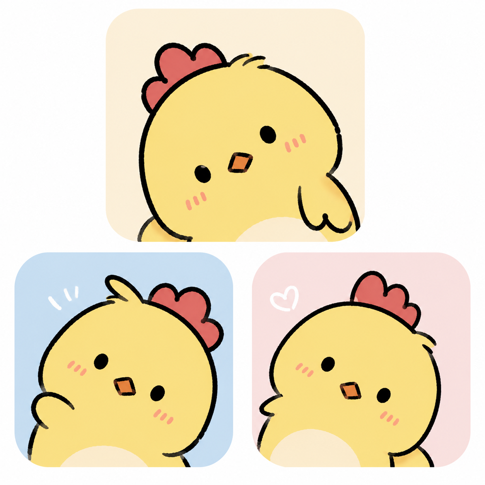
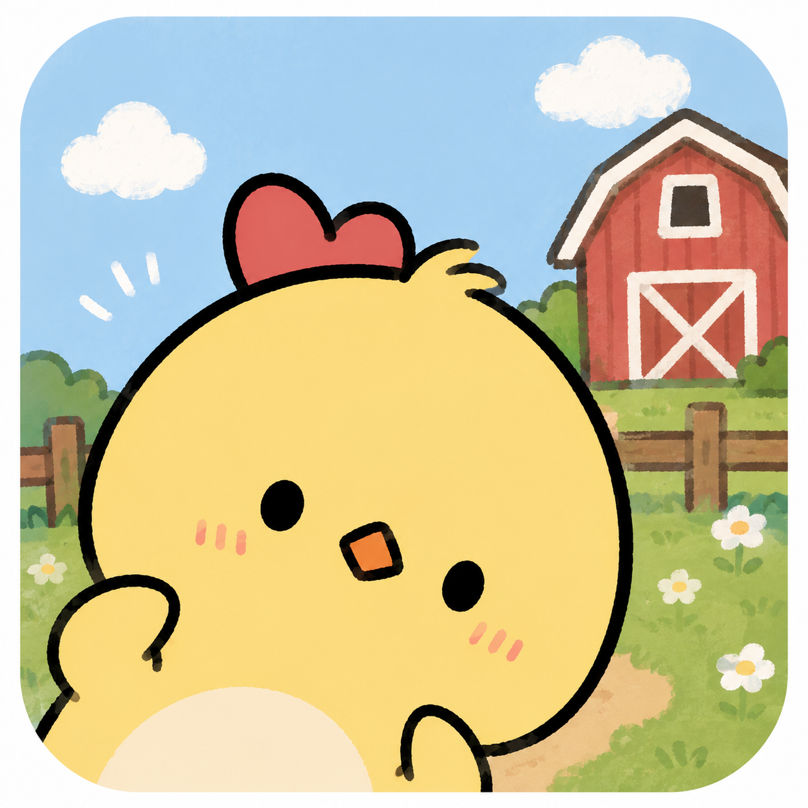

# F4 原始参考图登记

这些图片是项目的长期参考资料，不是临时附件。源文件以稳定英文名归档；参考母图不裁切、不缩放、不重新压缩。

## 1. 小鸡角色造型参考板

- 文件：[`chick-character-style-reference.png`](chick-character-style-reference.png)
- 原始尺寸/模式：1254×1254，RGB PNG
- SHA-256：`3E288BAD92EE827173DC3B533695FB9B25EB5E588A3C54739FE9C70B7110D0B2`
- 身份：角色造型与画风来源参考。
- 使用方式：校验小鸡的圆润比例、粗深色手绘轮廓、极简五官、腮红、柔和黄色水粉上色和可爱姿态。
- 限制：它是三格参考板，不直接作为运行时贴图；正式动作仍以当前 F4 的角色资产为直接身份母图。

## 2. 农场小鸡圆形 PWA 图标源母图

- 文件：[`pwa-icon-farm-master.png`](pwa-icon-farm-master.png)
- 原始尺寸/模式：1254×1254，RGB PNG
- SHA-256：`652F76E9AEC029E8CC87C063D99CFD8D577FBB461AC9DD854AA9EF7D0E37F721`
- 身份：小皮已经决定采用的 PWA 桌面图标源母图，也是农场环境与小鸡关系的重要原始参考。
- 图标规则：主体、倾斜角度、表情、农场构图、圆角画面和颜色关系不可重新设计。生产图标只允许按平台安全区做机械尺寸派生；不得让生成式 AI 重画。
- 当前状态：2026-07-17 已完成 180、192、512 和 512 maskable 四种生产尺寸派生；输出哈希与派生方法登记在 [`../../public/pwa-icon-manifest.json`](../../public/pwa-icon-manifest.json)。A2759 主屏幕实际显示仍属于最终真机验收。

## 参考优先级

- 新角色动作：当前 F4 对应角色资产负责身份一致性，本目录参考图负责防止画风漂移。
- 新农场或装饰：当前 F4 背景负责实际色温和材质，本目录农场图负责最初的构图气质。
- PWA 图标：`pwa-icon-farm-master.png` 是唯一源母图；`public/icon-*.png` 和 `public/apple-touch-icon.png` 必须能由登记记录追溯到它。
