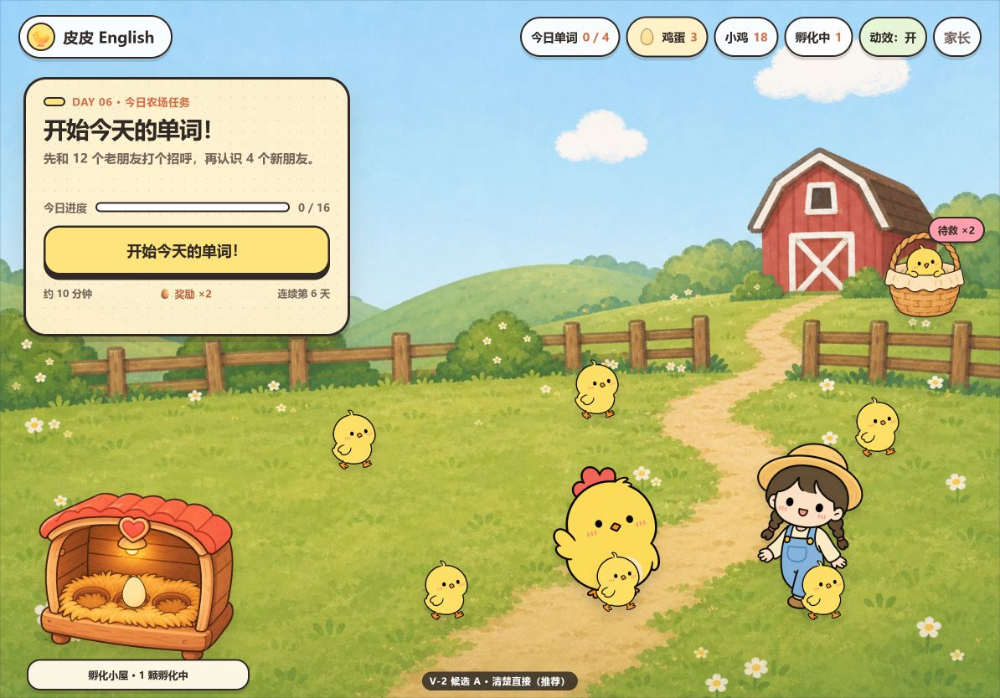
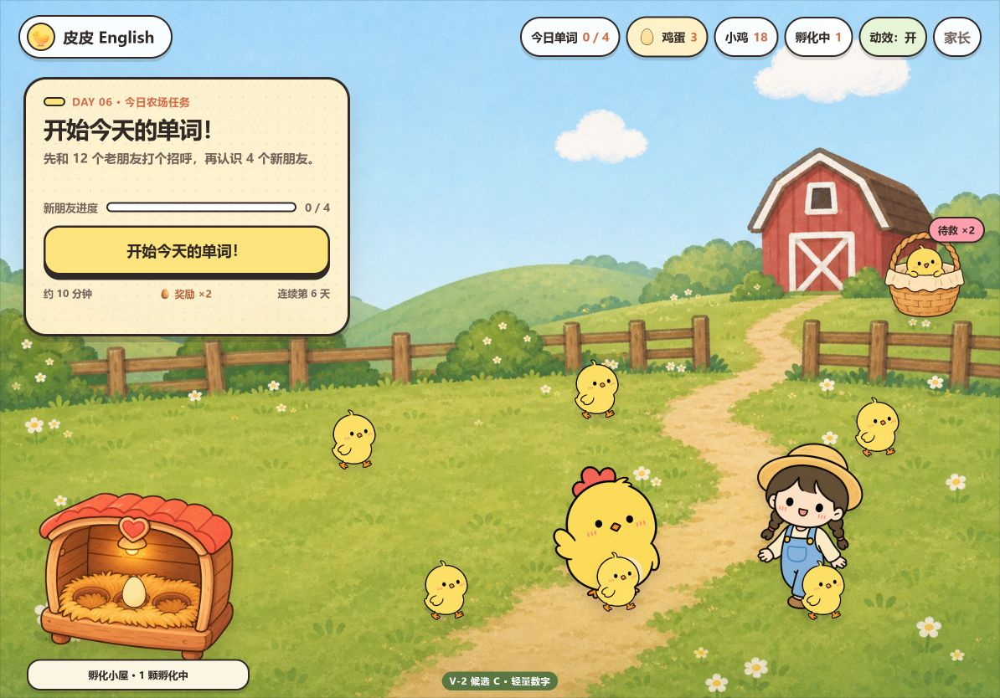

# V-2 · F4 首页文案排版候选

状态：`xiaopi-approved-b`  
日期：2026-07-17

本目录是阶段 C 前的独立视觉候选，不属于生产入口，不修改 `design-samples/**` 母版。2026-07-17 小皮选择候选 B，文案与排版已可进入阶段 C。

## 共同固定项

- 顶栏维持 F4 原结构，只把数字替换为 ViewModel 变量。
- 眉题：`DAY {dayNumber} · 今日农场任务`。
- 标题：`开始今天的单词！`。
- 底注：`约 {estimatedMinutes} 分钟 · 🥚 奖励 ×{eggsToEarn} · 连续第 {streak} 天`。
- 孵化棚按 V-1 裁决移除倒计时和进度条，只保留 `孵化小屋 · {n} 颗孵化中`。
- 示例数据：12 个复习、4 个新词、约 10 分钟、奖励 2 颗蛋、连续第 6 天。

## 三个候选

### A · 清楚直接（未选）

- 正文：`先和 12 个老朋友打个招呼，再认识 4 个新朋友。`
- 进度：`今日进度 0 / 16`，每完成一个复习或新词任务都会前进。
- 按钮：`开始今天的单词！`。
- 推荐原因：顺序最明确，没有“想你了”可能带来的轻微欠情感；按钮具体，进度对全部任务如实反馈。

### B · 温暖邀约（小皮已选）

- 正文：`12 个老朋友想你了！打完招呼再认识 4 个新朋友。`
- 进度：`今日进度 0 / 16`。
- 按钮：`开始学习！`。
- 取舍：更有角色感，但“想你了”可能被理解成需要赶紧回应，因此情绪压力略高于 A。

### C · 轻量数字

- 正文与 A 相同。
- 进度：`新朋友进度 0 / 4`。
- 按钮：`开始今天的单词！`。
- 取舍：数字最小，但复习阶段进度不会变化，前 12 项操作缺少连续反馈，因此不建议作为默认方案。

## 其他验证

- `V2-A-NO-REVIEWS-1194x834.png`：零复习日分支，正文为 `认识 4 个新朋友，完成后母鸡妈妈会下蛋哦。`。
- `V2-A-IP13-1366x1024.png`：候选 A 的 iPad Pro 13 英寸横屏截图；核心舞台无内部重排。
- 长数字压力检查：25 个复习、13 分钟、128 颗蛋、9999 只小鸡、365 天连胜时，顶栏、任务板和底注均无溢出。
- 所有 12 张本地图片加载成功；浏览器控制台 0 error / 0 warning。

## 拍板结果

小皮选择 **B**，理由是“简单直接”。阶段 C 使用以下组合：

1. 正文：`{reviewCountToday} 个老朋友想你了！打完招呼再认识 {dailyTarget} 个新朋友。`；
2. 进度：全部任务 `{learnedToday} / {totalItemsToday}`；
3. 按钮：`开始学习！`。

本候选目录继续保留为决策证据。
